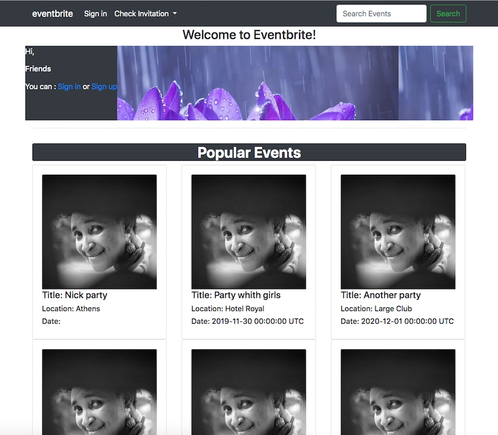

# Private events project using Ruby on Rails

In this project we build a site similar to a private Eventbrite which allows users to create events and then manage user signups. Users can create events. Events take place at a specific date and at a location (which you can just store as a string, like “Andy’s House”). A user can create events. A user can attend many events. An event can be attended by many users.

## Screenshot



To see more information and learn about Rails check this [Ruby on Rails](https://www.railstutorial.org/book) Tutorial book.

## Features

* User can see all the users on the list
* User can signup or signin
* After signing in a user can see upcoming events, past events and created events
* A user can create an event after signing in

## Future Feature (v1.2)

- Add animations
- User can send invite to others
- Improve the UI

## Built With

- HTML,SCSS
- Ruby on Rails 5.1.2,
- Bootstrap 4

## Live Demo

[Live Demo Link](https://livedemo.com)


## Getting started

To get started with the app, first clone the repo

```
git clone  https://github.com/addod19/private-events.git
```

Then install the needed gems:

```
bundle install --without production
```

Next, migrate the database:

```
 rails db:migrate
```

Finally, run the app in a local server:

```
 rails server
```

### Prerequisites

> HTML <br>
> SCSS

### Setup
```
Step 1: Install Prerequisite Dependencies
Step 2: Install rbenv
Step 3: Install Ruby
Step 4: Install Rails
```

### Install

```
gem 'rspec-rails'
gem 'capybara', '>= 2.15'
gem 'database_cleaner'
gem 'webdrivers', '~> 4.0'
gem 'bootstrap', '~> 4.3.1'
gem 'bootstrap-will_paginate', '1.0.0'
gem 'font-awesome-sass', '~> 5.11.2'
```

### Usage

```
git clone  https://github.com/addod19/private-events.git
bundle install --without production
rails db:migrate
rails s
```

### Run tests
```
rspec -fd
```

### Deployment with git and heroku
```
heroku create
git push heroku master
heroku run rails db:migrate
heroku open
```


## Authors

👤 **Author1**

- Github: [@addod19](https://github.com/addod19)
- Twitter: [@DanielLarbiAdd1](https://twitter.com/DanielLarbiAdd1)
- Linkedin: [daniel](https://linkedin.com/in/daniel-larbi-addo-9738b0128/)
- Email: (addodaniellarbi@gmail.com)

👤 **Author2**

- Github: [@macnick](https://github.com/macnick)
- Twitter: [@mac_experts](https://twitter.com/mac_experts)
- Linkedin: [Nick Haralampopoulos](https://www.linkedin.com/in/nick-haralampopoulos-26a55412a/)


## 🤝 Contributing

Contributions, issues and feature requests are welcome!

Feel free to check the [issues page](issues/).

## Show your support

Give a ⭐️ if you like this project!


## 📝 License

This project is [MiT](lic.url) licensed.

